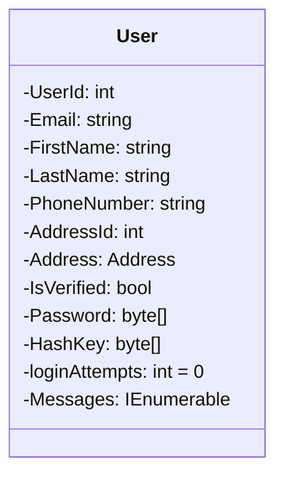
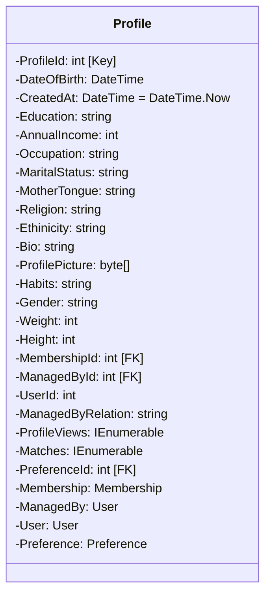
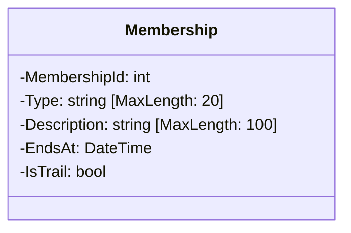
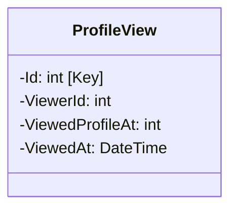
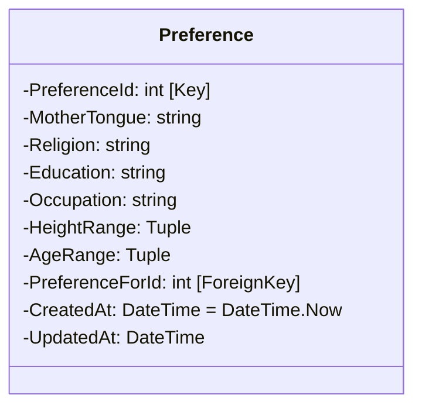
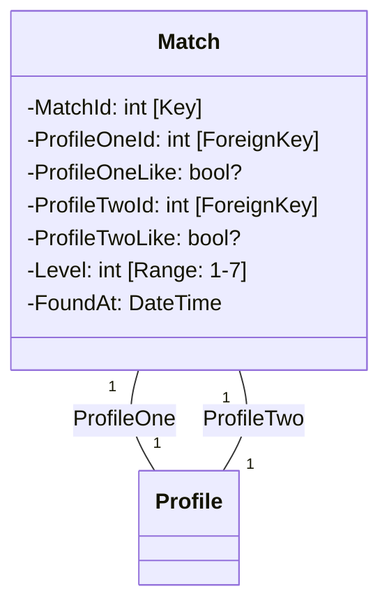
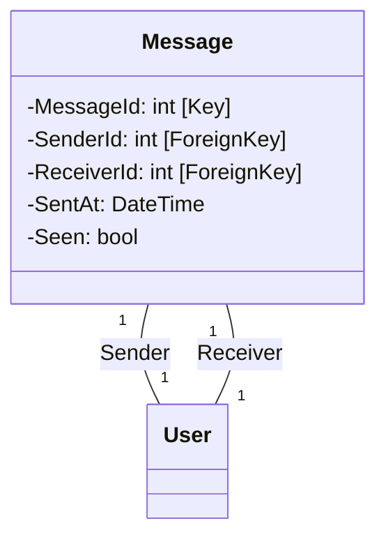
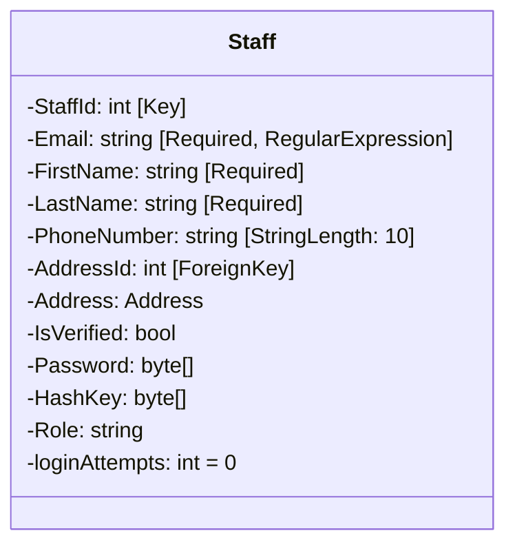

# Service Func
---
1. User -> can manager multiple profiles ( as with relation )
2. MemberShip of (Basic & Premium). Premium -> chat (without sharing creds) & profile view
3. Preference -> cumulative set of preference and segrigates results
4. A match is generated and shared between two, if both accepted can share profiles.
5. Staff -> Background staffs Admin and Employees
6. Premium -> ( 25 profile chats per month )
7. CRON & startup based premium validation
8. Free Train for basic user ( 7 days as premium user )
## Entities
---
- User 



- Profile

- MemberShip

- ProfileView

- Preference

- Match

- Message

- Staff



# Developer Notes
---
### Accessor can be recursive :)
```csharp
public DateTime DateOfBirth  
{  
    get => DateOfBirth;  
    set => {
		DateOfBirth = value; // on recursive sets value to DateOfBirth
	    Age = DateTime.Today.Year - value.Year;  
	}
}
```
### Required attribute instead of nullable
```csharp
[MaxLength(30)] public required string State { get; set; }
							|
							Ensures that object is not getting initialized without passing those properties
```

Ok then what about `Annotations.Required` and keyword `required`
```cs
[Required] // does it in runtime
public required Entity entity; // does it in compile-time
```
using it both is a over kill:
- `Annotations.Required` can be used for DTO's since it's constant input kinda data.
- `required` can be used for internal must one like entity.


### Layer by Feature 
[ref](https://www.jimmybogard.com/vertical-slice-architecture/)
- removes the complexity look why developing

### TPC (Table Per Concrete Type)
[ref](https://www.scholarhat.com/tutorial/entityframework/understanding-inheritance-in-entity-**framework)
- Here I have used TPC inheritance for the entities, which reduces lot of boiler plate from the repos

## Handling two one to one relations
```csharp
modelBuilder.Entity<Profile.Profile>()  
    .HasMany<Match.Match>(profile => profile.Matches)  
    .WithOne(match => match.ProfileOne)  
    .HasForeignKey(match => match.ProfileOneId)  
    .OnDelete(DeleteBehavior.NoAction);  
modelBuilder.Entity<Profile.Profile>()  
    .HasMany<Match.Match>(profile => profile.Matches)  
    .WithOne(match => match.ProfileTwo)  
    .HasForeignKey(match => match.ProfileTwoId)  
    .OnDelete(DeleteBehavior.NoAction);

modelBuilder.Entity<Match.Match>()  
    .HasOne<Profile.Profile>(match => match.ProfileOne)  
    .WithMany()  
    .OnDelete(DeleteBehavior.Cascade);  
modelBuilder.Entity<Match.Match>()  
    .HasOne<Profile.Profile>(match => match.ProfileTwo)  
    .WithMany()  
    .OnDelete(DeleteBehavior.Cascade);
```
with this tried to establish one to one between profile matches, but under profile it's just a single ennumerable collection
- got this a error while adding migration
```powershell
Unable to create a 'DbContext' of type ''. The exception 'Cannot create a relationship between 'Profile.Matches' and 'Match.ProfileTwo' because a relationship already exists between 'Profile.Matches' and 'Match.ProfileOne'. Navigations can only participate in a single relationship. If you want to override an existing relationship call 'Ignore' on the navigation 'Match.ProfileTwo' first in 'OnModelCreating'.' was thrown while attempting to create an instance. For the different patterns supported at design time, see https://go.microsoft.com/fwlink/?linkid=851728
```

Solution:
- For Ef to handle this kind of multiple one to many relations, just have them in separate ICollections
```csharp
modelBuilder.Entity<Match.Match>()  
    .HasOne<Profile.Profile>(match => match.SentProfile)  
    .WithMany(profile => profile.SentMatches)  
    .OnDelete(DeleteBehavior.NoAction);  
modelBuilder.Entity<Match.Match>()  
    .HasOne<Profile.Profile>(match => match.ReceivedProfile)  
    .WithMany(profile => profile.ReceivedMatches)  
    .OnDelete(DeleteBehavior.NoAction);


```

## New changes in NUnit 4
[ref](https://docs.nunit.org/articles/nunit/release-notes/breaking-changes.html):w

- All the legacy assertion will be under `ClassicAssert lib`
