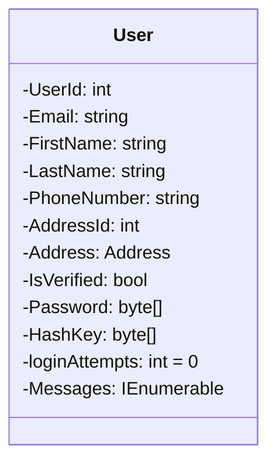
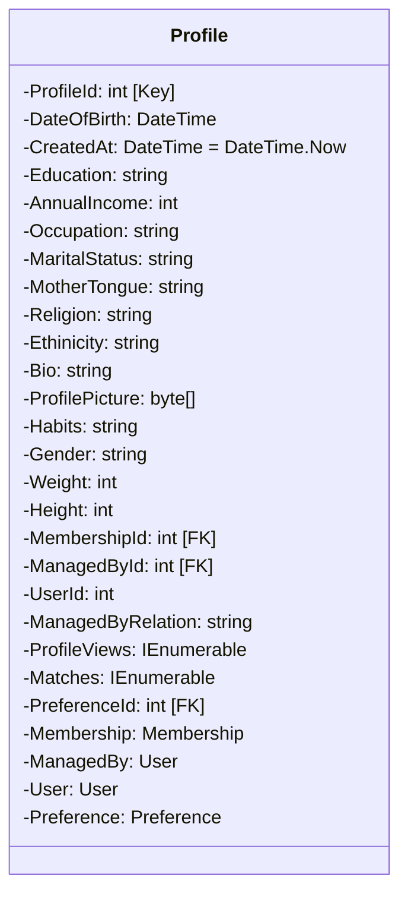
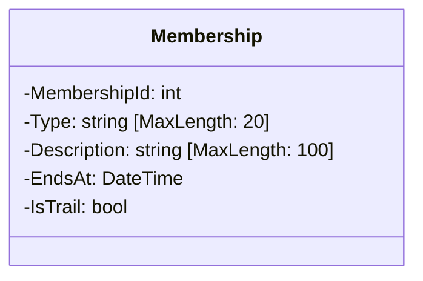
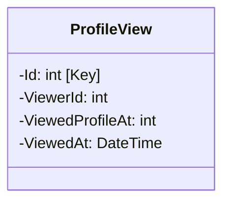
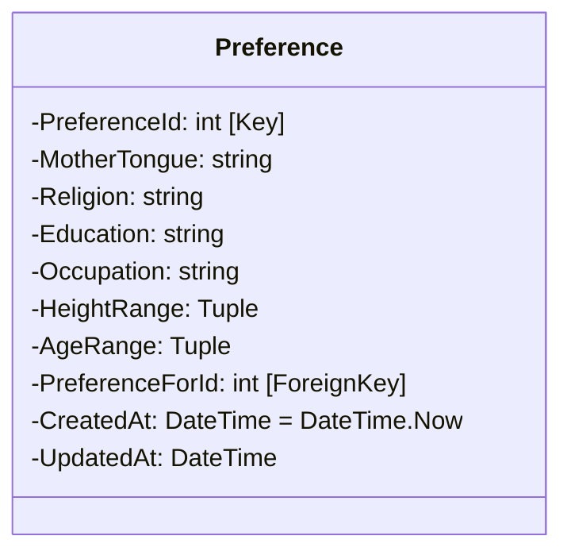
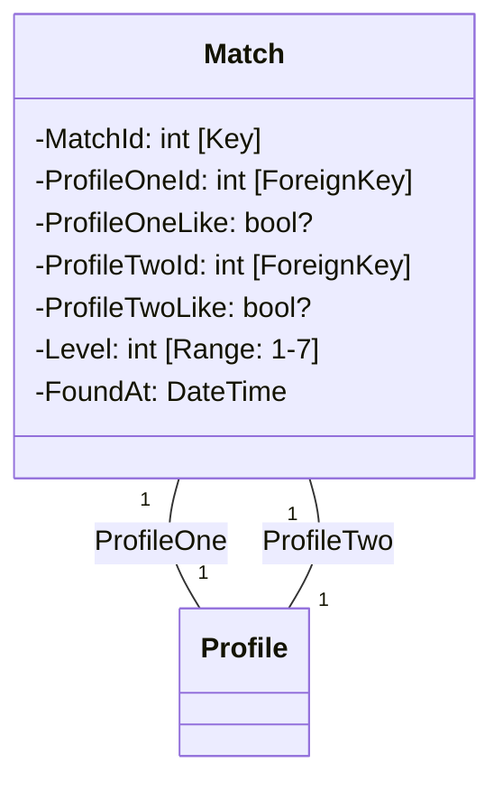
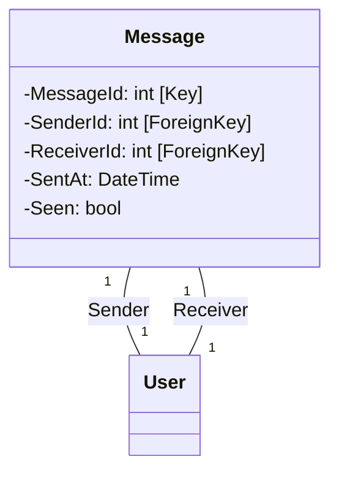
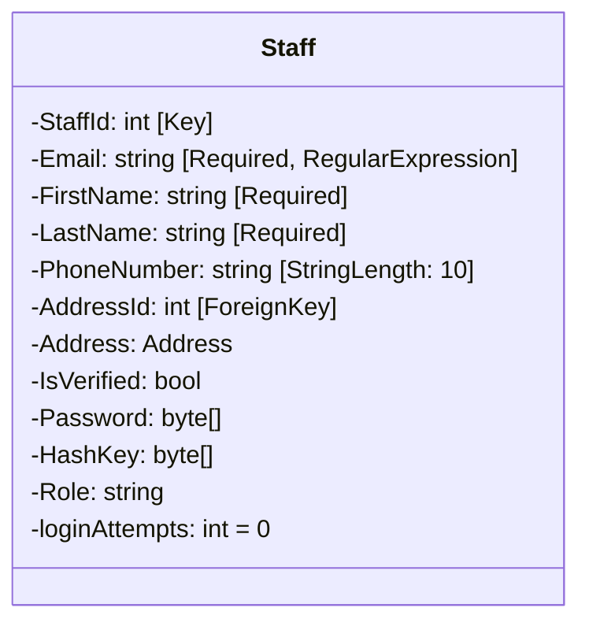

# Service Func
---
1. User -> can manager multiple profiles ( as with relation )
2. MemberShip of (Basic & Premium). Premium -> chat (without sharing creds) & profile view
3. Preference -> cumulative set of preference and segrigates results
4. A match is generated and shared between two, if both accepted can share profiles.
5. Staff -> Background staffs Admin and Employees
6. Premium -> ( 25 profile chats per month )
7. CRON & startup based premium validation
8. Free Train for basic user ( 7 days as premium user )
## Entities
---
- User 

- Profile

- MemberShip

- ProfileView

- Preference

- Match

- Message

- Staff

